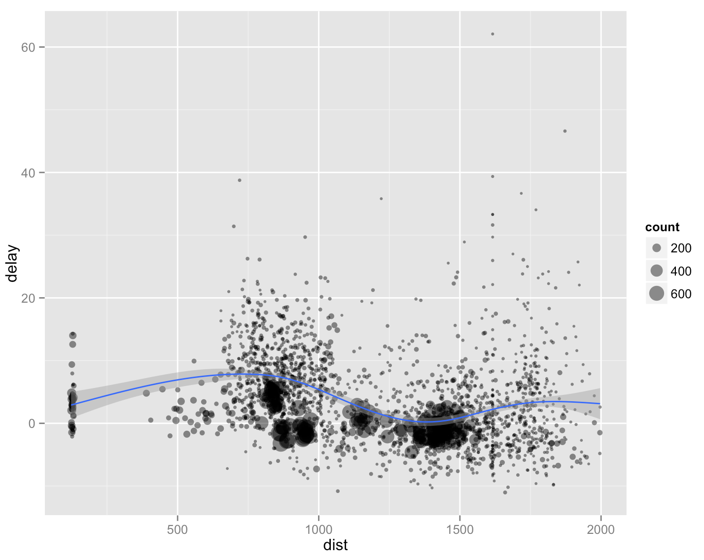

### BYOPlot

Choose a built-in dataset of interest (e.g. `diamonds`, `mtcars`,
`CO2`, `quakes`) and construct plots using the following geoms (or others we 
haven't seen!) to reveal an interesting relationship.

- `geom_smooth`
- `geom_histogram`
- `geom_density`
- `geom_boxplot`

You will be presenting one of these plots to the group.

* * *

## Flights

1. The plot below displays the relationship between the mean arrival 
delay and the mean distance travelled by every plane in the data set. 
It also shows the total number of flights made by each plane by the 
size of the plotted circle. Please form a single chain that will 
create this plot, starting with the raw data set. You will also want 
to exclude the edge cases from your analysis, so focus on the
planes that have logged more than 20 flights and flown an average
distance of less than 2000 miles.

1. There are two plots that show up 
in the `dplyr` slides. How could these be improved to make them easier to read/interpret? Please implement these improvements.

* * *

### One last time...Global Warming!

Rebuild the plots that you generated according to exercises 4 and 9 using
the dataframe you previously contructed, `dplyr`, and `ggplot2`. Recycle dataframes
and plots whereever you can.

